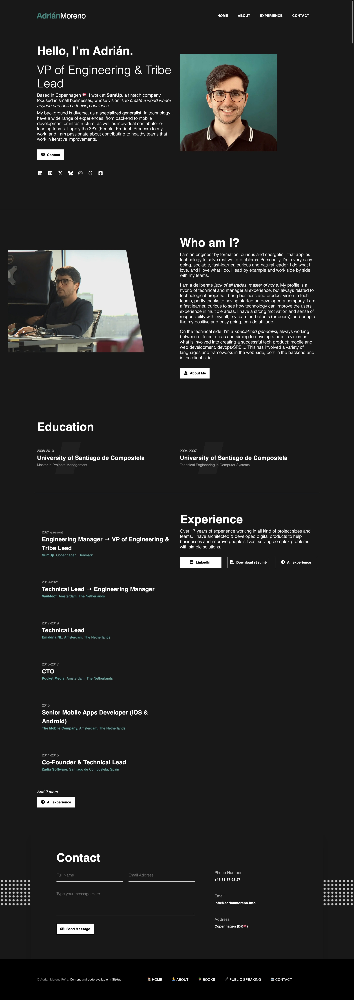
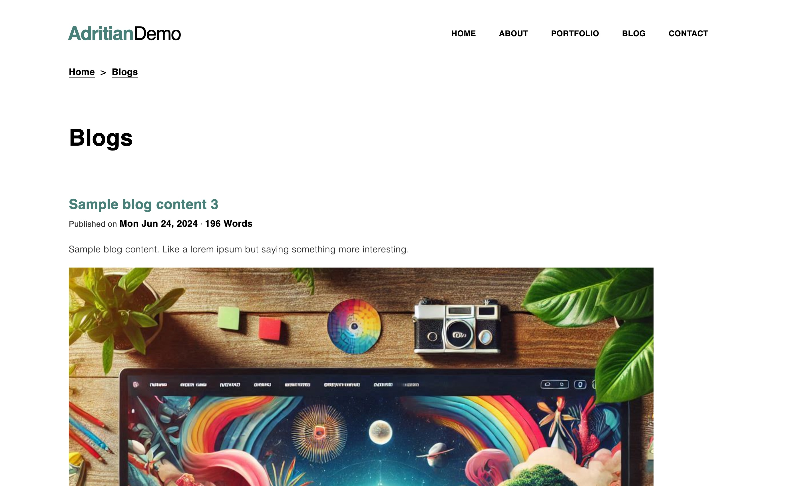
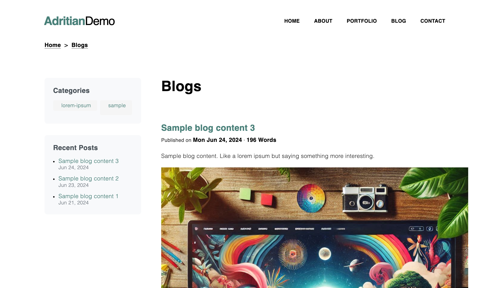

# Adritian Free Hugo Theme
A modern Hugo theme for personal websites and professional landing pages - with blog and portfolio support

[
](https://adritian-demo.vercel.app/)

## 🚀 Key Features

- 🏎️ Fast, minimalistic code (no jQuery)
- 🖼️ Bootstrap v5 (`v5.3.3`) framework with Scss customization
- 📚 Multi-language (i18n) support
- 🛠️ Custom content types (work experience, blog)
- 💯 Perfect Lighthouse scores (Performance, Accessibility, SEO)
- 🌚 Automatic dark/light theme switching
- ⚡ Vercel-ready with Analytics & Speed Insights support

The theme focuses on accessibility, high performance and usability (being very easy to get started). It's extendable by adding your own styles or content types, with a solid foundation you can built on.

Some of the best applications for the theme are for minimalistic websites, single-page applications, and personal portfolios. It has a contact form you can customize to your mail address without setting up a backend.

__Technical note on Bootstrap__: the theme includes Bootstrap embedded in the codebase - it's not imported as a module to facilitate the use of the theme in any way (Hugo module, git submodule, or copying the files to an existing site).

## Live demo & Preview

You can see it live at [www.adrianmoreno.info](https://www.adrianmoreno.info) (my personal website), as well as in these screenshots of the homepage, in the dark and light variations of the theme:

<table>
	<tbody>
	<tr>
		<td>
			
</td>
		<td>
			
</td>
	</tr>
	</tbody>
</table>

The dark color variation is selected automatically based on browser settings, and there's a color switcher available in the footer to allow the visitors to override.

You have two reference implementations of the theme provided:

1. A full-featured site, [my personal website](https://www.adrianmoreno.info) [in github too](https://github.com/zetxek/adrianmoreno.info)
2. A simpler [demo site for the theme, adritian-demo](https://adritian-demo.vercel.app/) ([and its code](https://github.com/zetxek/adritian-demo)).


## Quickstart

#### Install Hugo

To use `adritian-free-hugo-theme` you need to install Hugo by following https://gohugo.io/getting-started/installing/.

We recommend installing the theme as a [Hugo module](https://gohugo.io/hugo-modules/) (recommended, and explained below).

Other alternative is to use [git submodules](https://gohugo.io/getting-started/quick-start/#create-a-site), or to [download the theme as a zip file](https://github.com/zetxek/adritian-free-hugo-theme/releases), and copy the files to your site. But that will lead to your site being "stuck in time" and more difficult to upgrade. **This is not recommended or supported directly**.

### As a Hugo Module (recommended)

> **Note:** Ensure you have **Go** and **Hugo** installed, and that you have created a new Hugo project before proceeding.

As a pre-requirement, you will need Hugo set up and running. You can follow [the official guide for it](https://gohugo.io/categories/installation/).

The theme has been tested with the version `0.136` of Hugo. If you get errors regarding missing functionalities, check if you have the last version of Hugo available.

Note: the theme supports both Hugo modules and git submodules. To install the theme in most maintanable way you should use Hugo modules. If you prefer git submodules you can follow these [older instructions](https://gohugobrasil.netlify.app/themes/installing-and-using-themes/) or the next ones as help:

<details>
<summary>Instructions to setup the theme as a hugo module</summary>

1. Create a new Hugo site (this will create a new folder): `hugo new site <your website's name>`
1. Enter the newly created folder: `cd <your website's name>/`
1. Initialize Hugo Module system in your site if you haven't already: `hugo mod init github.com/username/your-site` (_you don't need to host your website on github, you can add anything as a name_)
1. Replace the contents of your config file (`hugo.toml`) file by these: 


<details>
<summary>hugo.toml configuration</summary>

```
baseURL = "<your website url>"
languageCode = "en"

[module]
[module.hugoVersion]
# We use hugo.Deps to list dependencies, which was added in Hugo 0.92.0
min = "0.92.0"

[[module.imports]]
path="github.com/zetxek/adritian-free-hugo-theme"

[params]

  title = 'Your website title'
  description = 'Your website description'
  sections = ["showcase", "about", "education", "experience", "client-and-work", "testimonial", "contact", "newsletter"]

  # If you want to display an image logo in the header, you can add it here
  # logo = '/img/hugo.svg'
  homepageExperienceCount = 6

  [params.analytics]
  ## Analytics parameters.
  ### Supported so far: Vercel (Page Insights, Analytics)
  ### And Google (Tag Manager, Analytics)

  # controls vercel page insights - disabled by default
  # to enable, just set to true
  vercelPageInsights = false
  vercelAnalytics = false
  
  # google analytics and tag manager. to enable, set "enabled" to true
  # and add the tracking code (UA-something for analytics, GTM-something for tag manager)
  [params.analytics.googleAnalytics]
      code = "UA-XXXXX-Y"
      enabled = false
  [params.analytics.googleTagManager]
      code = "GTM-XXXXX"
      enabled = false

[build]
  [build.buildStats]
    disableClasses = false
    disableIDs = false
    disableTags = false
    enable = true

[params.languages.selector.disable]
  footer = false

[languages]
  [languages.en]
    disabled = false
    languageCode = 'en'
    languageDirection = 'ltr'
    languageName = 'English'
    title = ''
    weight = 0

    [languages.en.menus]
      [[languages.en.menus.header]]
        name = 'About'
        URL = '#about'
        weight = 2
      [[languages.en.menus.header]]
        name = 'Portfolio'
        URL = '#portfolio'
        weight = 3
      #  [[languages.en.menus.header]]
      #  name = "Experience"
      #  URL = "#experience"
      #  weight = 4

      [[languages.en.menus.header]]
        name = "Blog"
        URL = "/blog"
        weight = 5

      [[languages.en.menus.header]]
        name = "Contact"
        URL = "#contact"
        weight = 6

      [[languages.en.menus.footer]]
        name = "About"
        URL = "#about"
        weight = 2

      [[languages.en.menus.footer]]
        name = "Portfolio"
        URL = "#portfolio"
        weight = 3

      [[languages.en.menus.footer]]
        name = "Contact"
        URL = "#contact"
        weight = 4


  [languages.es]
    disabled = false
    languageCode = 'es'
    languageDirection = 'ltr'
    languageName = 'Español'
    title = ''
    weight = 0
      [[languages.es.menus.header]]
        name = 'Sobre mi'
        URL = '/es/#about'
        weight = 2
      [[languages.es.menus.header]]
        name = 'Portfolio'
        URL = '/es/#portfolio'
        weight = 3

      #  [[languages.es.menus.header]]
      #  name = "Experiencia"
      #  URL = "/es/#experience"
      #  weight = 4

      [[languages.es.menus.header]]
        name = "Blog"
        URL = "/es/blog"
        weight = 5

      [[languages.es.menus.header]]
        name = "Contacto"
        URL = "/es/#contact"
        weight = 6

      [[languages.es.menus.footer]]
        name = "Sobre mi"
        URL = "/es/#about"
        weight = 2

      [[languages.es.menus.footer]]
        name = "Portfolio"
        URL = "/es/#portfolio"
        weight = 3

      [[languages.es.menus.footer]]
        name = "Contact"
        URL = "/es/#contact"
        weight = 4

  [languages.fr]
    disabled = false
    languageCode = 'fr'
    languageDirection = 'ltr'
    languageName = 'Français'
    title = ''
    weight = 0

    [languages.fr.menus]
      [[languages.fr.menus.header]]
        name = 'About'
        URL = '#about'
        weight = 2
      [[languages.fr.menus.header]]
        name = 'Portfolio'
        URL = '#portfolio'
        weight = 3
      #  [[languages.fr.menus.header]]
      #  name = "Experience"
      #  URL = "#experience"
      #  weight = 4

      [[languages.fr.menus.header]]
        name = "Blog"
        URL = "/blog"
        weight = 5

      [[languages.fr.menus.header]]
        name = "Contact"
        URL = "#contact"
        weight = 6

      [[languages.fr.menus.footer]]
        name = "About"
        URL = "#about"
        weight = 2

      [[languages.fr.menus.footer]]
        name = "Portfolio"
        URL = "#portfolio"
        weight = 3

      [[languages.fr.menus.footer]]
        name = "Contact"
        URL = "#contact"
        weight = 4

# Plugins
[params.plugins]

  # CSS Plugins
  [[params.plugins.css]]
  URL = "css/custom.css"
  [[params.plugins.css]]
  URL = "css/adritian-icons.css"
  
  # JS Plugins
  [[params.plugins.js]]
  URL = "js/rad-animations.js"
  [[params.plugins.js]]
  URL = "js/sticky-header.js"
  [[params.plugins.js]]
  URL = "js/library/fontfaceobserver.js"

  # SCSS Plugins
  [[params.plugins.scss]]
  URL = "scss/adritian.scss"


# theme/color style 
[params.colorTheme]

## the following configuration would disable automatic theme selection
#  [params.colorTheme.auto]
#    disable = true
#  [params.colorTheme.forced]
#    theme = "dark"

## the following parameter will disable theme override in the footer
#  [params.colorTheme.selector.disable]
#  footer = true


## by default we allow override AND automatic selection

[params.blog]
layout = "default" # options: default, sidebar
sidebarWidth = "25" # percentage width of the sidebar
showCategories = true
showRecentPosts = true
recentPostCount = 5
listStyle = "summary" # options: simple, summary
```
</details>

This configuration allows you to have a base to edit and adapt to your site, and see the available functionalities.
Make sure to edit `baseURL`, `title` and `description`. You can edit the header links, as well as the languages to your needs.

1. Get the module: `hugo mod get -u`
1. Execute `hugo mod npm pack` - this will generate a `package.json` file in the root folder of your site, with the dependencies for the theme.
1. Execute `npm install` - this will install the dependencies for the theme (including bootstrap)
1. (Optional, to override the defaults) Create a file `data/homepage.yml` with the contents of the [`exampleSite/data/homepage.yml`](https://github.com/zetxek/adritian-free-hugo-theme/blob/main/exampleSite/data/homepage.yml) file, and customize to your needs.
1. Start Hugo with `hugo server`...
1. 🎉 The theme is alive on http://localhost:1313/

</details>


### Traditional Installation (as git submodule)

If you prefer not to use Hugo Modules, you can still install the theme as a git submodule.
The guide is very similar to [official "Quick Start"](https://gohugo.io/getting-started/quick-start/#create-a-site), just changing the theme URL in the `git submodule add` command: 

<details>
<summary>Old instructions for git submodules</summary>

- Create a new Hugo site (this will create a new folder): `hugo new site <your website's name>`
- Enter the newly created folder: `cd <your website's name>/`
- Initialize hugo modules: `hugo mod init github.com/<your_user>/<your_project>`
- Install PostCSS: execute `npm i -D postcss postcss-cli autoprefixer` from the top-level site folder [check [Hugo's official docs](https://gohugo.io/hugo-pipes/postcss/)].
- Add adritian-free-hugo-theme as a module dependency, by adding
  ```
  [module]
  [[module.imports]]
    path = 'github.com/zetxek/adritian-free-hugo-theme'
  ```
  To your `hugo.toml` file, and executing `hugo mod get -u`
  
- Replace the `hugo.toml` file in the project's root directory with the contents of [themes/adritian-free-hugo-theme/exampleSite/config.toml](https://github.com/zetxek/adritian-free-hugo-theme/blob/main/exampleSite/hugo.toml). If you are using the git submodules, you can execute `cp themes/adritian-free-hugo-theme/exampleSite/hugo.toml hugo.toml` (*executed from the website root folder*), otherwise just copy and paste the contents.
- Create the file `data/homepage.yml`, with the initial contents of the [`exampleSite/data/homepage.yml`](https://github.com/zetxek/adritian-free-hugo-theme/blob/main/exampleSite/data/homepage.yml). This will serve as your starting point to customize your home content ✍️
- Start Hugo with `hugo server -D`
- 🎉 The theme is alive on http://localhost:1313/

</details>


---

After this, you can start adding your own content to the site, and customize the configuration.

_Optional:_
if you want to preview the theme with the example content before deciding if it's what you are looking for, you can run the theme with the example content:
```
cd themes/adritian-free-hugo-theme/exampleSite
hugo server --themesDir ../..
```

The output for the `serve` command will be something like this:
<details>
<summary>Example output for the serve command</summary>

```
adritian-demo git:(master) ✗ hugo server -D
Watching for changes in /Users/adrianmorenopena/tmp/theme-test/themes/adritian-free-hugo-theme/{archetypes,assets,data,exampleSite,i18n,layouts,static}
Watching for config changes in /Users/adrianmorenopena/tmp/theme-test/themes/adritian-free-hugo-theme/exampleSite/hugo.toml
Start building sites …
hugo v0.136.2+extended darwin/arm64 BuildDate=2024-10-17T14:30:05Z VendorInfo=brew


                   | EN | ES | FR
-------------------+----+----+-----
  Pages            | 24 | 10 |  8
  Paginator pages  |  0 |  0 |  0
  Non-page files   |  0 |  0 |  0
  Static files     | 90 | 90 | 90
  Processed images | 24 |  0 |  0
  Aliases          |  1 |  0 |  0
  Cleaned          |  0 |  0 |  0

Built in 1788 ms
Environment: "development"
Serving pages from disk
Running in Fast Render Mode. For full rebuilds on change: hugo server --disableFastRender
Web Server is available at http://localhost:1313/ (bind address 127.0.0.1)
Press Ctrl+C to stop
```
</details>

#### Multi-language support

https://github.com/user-attachments/assets/030e765a-275f-4141-88e0-b854ebe551da

The theme implements the [internationalization (i18n) system by Hugo](https://gohugo.io/content-management/multilingual/), to enable multilingual sites.

See the content in `i18n` to edit the translations, and the configuration `hugo.toml` to define your active languages. The example site has 3 enabled languages (`en` for English, `es` for Spanish and `fr` for French).

You can add additional languages, or disable the provided ones (by setting `disabled` to `true` on the languages you don't need).

The introduction of i18n support was done in the version `v1.3.0` and it has breaking changes due to the way in which the content was managed. You can read about the upgrade path in [UPGRADING.md](UPGRADING.md).


#### Additional configuration

##### Contact form
_(optional, if you want to use the contact form)_ edit line 212 in your `homepage.yml` file, to customize your mail address. Sign up in [formspree](https://formspree.io) to redirect mails to your own.

##### Blog

Two layouts are available for the blog:
- `default` (full-width for posts)
- `sidebar` (sidebar with recent posts and categories)

| Default Layout | Sidebar Layout |
|---------------|----------------|
|  |  |
| Full width posts | Posts with left sidebar |
| Clean, focused reading experience | Shows recent posts and categories |
| Maximizes content area | 25% width sidebar by default |
| Best for image-heavy posts | Helps with site navigation |


To use the blog, you can use the content type "blog", and render it in the URL `/blog`.
You can add a menu link to it in `hugo.toml`.

The posts will be markdown files stored in the `content/blog` folder.

The layout can be configured in the `hugo.toml` file, under the `[params.blog]` section.

##### Experience

This functionality and content is especially suited for personal professional sites, showcasing the work experience: 


It can be used to render job experience, projects or clients. Each experience/project has a duration, job title, company name, location and description/excerpt as well as a longer text. 

The experience is managed through a specific content type (see `content/experience` for an example).
You can use `hugo new experience/experience-name.md` (replacing `experience-name` by the name of the job experience).
This will create the content in the `content/experience` folder, following the `experience` archetype.

The following fields are used from the file's Front Matter: `title`, `jobTitle`, `company`, `location`, `duration`. 
You can find a sample experience file content here:

```
---
date: 2007-12-01T00:00:00+01:00
draft: false
title: "Job #1"
jobTitle: "Junior Intern"
company: "Internet Affairs Inc. "
location: "Stavanger, Norway"
duration: "2022-2024"

---
### Fixing the world, one byte at a time

The beginning of a great career. 
```

The experience is displayed in several locations:

1. Homepage, with a limited number of experiences (controlled by the config parameter `homepageExperienceCount` in the file `hugo.toml`). The summary is displayed. 
2. Experience page, in `/experience`, with a list of all experiences (no limit). The summary is displayed for each item.
3. Individual experience page, where all details are displayed

## Troubleshooting

This theme is a version of the one found on my website [adrianmoreno.info](https://www.adrianmoreno.info). If you run into trouble, [you can check the code on my website](https://github.com/zetxek/adrianmoreno.info) for reference.

If you have improvements for the theme, you are very welcome to make a PR if you are able 💕. Otherwise - see below for how to get help (and maybe help others with the same problem).

## Getting help

The project is offered "as is", and it's a hobby project that powers my personal website. Support is given whenever life allows - you can create an issue [create an issue](https://github.com/zetxek/adritian-free-hugo-theme/issues) so anyone else could also help, or the author.

## Showcase

Have you used the theme in your website? Send a PR to add it to the list for inspiration! (Extra points if the repo is open source :-)

- [demo site](https://adritian.vercel.app)
- [adrian moreno's personal site](https://www.adrianmoreno.info)
- https://davidcorto.es/ (https://github.com/dcorto/dcorto.github.io) *⭐ theme contributor*
- https://cwb.dk/ (https://github.com/C0DK/C0DK.github.io)
- https://shaun.gg/ (https://github.com/shauncampbell/shaun_dot_gg)
- https://trevorpiltch.com/ (https://github.com/trevorpiltch/trevorpiltch.github.io)
- https://vega-2135.github.io/ (https://github.com/vega-2135/vega-2135.github.io)
- https://talinashrotriya.com/ (https://github.com/Talina06/talina06.github.io)
- https://loseardes77.github.io/hugo-portfolio/ (https://github.com/LOSEARDES77/hugo-portfolio)
- https://chandanpasunoori.com/ (https://github.com/chandanpasunoori/www.chandanpasunoori.com)
- https://sathvikracha.com/ (https://github.com/sathvikracha/sathvikracha.com)
- https://jlruan.me/ (https://github.com/jlruan/jlruan.github.io)
- https://chenyugu.com/ (https://github.com/ChyenGCY/ChyenGCY.github.io)
- https://benjaminkoltermann.me/ (https://github.com/p4ck3t0/websites)
- https://kaiasaoka.github.io/ (https://KaiAsaoka/KaiAsaoka.github.io.old)
- https://guillaumebabik.github.io/ (https://github.com/guillaumebabik/guillaumebabik.github.io)
- https://oldgo.fael.my.id/danielweb/ (https://github.com/burnblazter/danielweb)
- https://www.davidfreitag.com/ (https://github.com/dkfreitag/davidfreitag-com)
- add your website here!

## Contributors 

<!-- readme: collaborators,contributors -start -->
<table>
	<tbody>
		<tr>
            <td align="center">
                <a href="https://github.com/zetxek">
                    
                    <br />
                    <sub><b>Adrián Moreno Peña</b></sub>
                </a>
            </td>
            <td align="center">
                <a href="https://github.com/mnordhaus">
                    
                    <br />
                    <sub><b>mnordhaus</b></sub>
                </a>
            </td>
            <td align="center">
                <a href="https://github.com/dcorto">
                    
                    <br />
                    <sub><b>D. Corto</b></sub>
                </a>
            </td>
            <td align="center">
                <a href="https://github.com/selmanceker">
                    
                    <br />
                    <sub><b>selmanceker</b></sub>
                </a>
            </td>
            <td align="center">
                <a href="https://github.com/AtocM">
                    
                    <br />
                    <sub><b>Murat Öcal</b></sub>
                </a>
            </td>
            <td align="center">
                <a href="https://github.com/fhinok">
                    
                    <br />
                    <sub><b>Sämi Will</b></sub>
                </a>
            </td>
		</tr>
		<tr>
            <td align="center">
                <a href="https://github.com/martinsam">
                    
                    <br />
                    <sub><b>Samuel Martin</b></sub>
                </a>
            </td>
            <td align="center">
                <a href="https://github.com/oaksakal">
                    
                    <br />
                    <sub><b>Ozgur Aksakal</b></sub>
                </a>
            </td>
            <td align="center">
                <a href="https://github.com/raulalmeidatarazona">
                    
                    <br />
                    <sub><b>Raul Almeida</b></sub>
                </a>
            </td>
            <td align="center">
                <a href="https://github.com/Ceesaxp">
                    
                    <br />
                    <sub><b>Andrei Popov</b></sub>
                </a>
            </td>
            <td align="center">
                <a href="https://github.com/brandynmauro">
                    
                    <br />
                    <sub><b>Brandyn</b></sub>
                </a>
            </td>
            <td align="center">
                <a href="https://github.com/ericreid">
                    
                    <br />
                    <sub><b>Eric Reid</b></sub>
                </a>
            </td>
		</tr>
		<tr>
            <td align="center">
                <a href="https://github.com/BangKarlsen">
                    
                    <br />
                    <sub><b>Jesper Højgaard</b></sub>
                </a>
            </td>
            <td align="center">
                <a href="https://github.com/LeahWilleke">
                    
                    <br />
                    <sub><b>LeahWilleke</b></sub>
                </a>
            </td>
            <td align="center">
                <a href="https://github.com/lukasulc">
                    
                    <br />
                    <sub><b>Luka Šulc</b></sub>
                </a>
            </td>
            <td align="center">
                <a href="https://github.com/evolutionise">
                    
                    <br />
                    <sub><b>Alix</b></sub>
                </a>
            </td>
		</tr>
	<tbody>
</table>
<!-- readme: collaborators,contributors -end -->

## License

- Copyright 2020 Radity (https://radity.com/), 2022 Adrián Moreno Peña (https://www.adrianmoreno.info)
- Licensed under MIT (https://github.com/zetxek/adritian-free-hugo-theme/blob/master/LICENSE)
