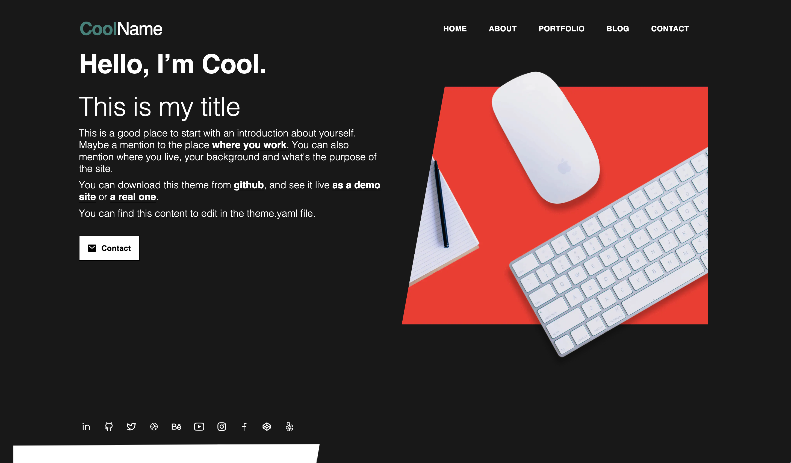

# Adritian Free Hugo Theme
###### Adritian Hugo Theme for Personal Websites or Professional minimalistic landing pages

See it live at **[adritian-demo.vercel.app](https://adritian-demo.vercel.app/)** (simple demo site, vanilla installation) or **[adrianmoreno.info](https://www.adrianmoreno.info)** (my personal site, running on this theme)

This free Hugo theme is a fork of [Raditian Theme](https://github.com/radity/raditian-free-hugo-theme) - a great Hugo theme originally created by [Radity](https://github.com/radity). It's called __Adritian__ because I, the author, am called Adrián - and if you shuffle Raditian and Adrián letters you get... Adritian 😅

It focuses on accessibility, high performance and usability. It's extendable by adding your own styles or content types, with a solid foundation.

The templates are based on Bootstrap (so they're responsive and mobile-first), and the main changes I have made have been upgrades on the web performance and accessibility of the template.

Some of the best applications for the theme are for minimalistic websites, single-page applications, and personal portfolios. It has a contact form you can customize to your mail address without setting up a backend (https://formspree.io).


🚀 Some of the improvements (vs the original theme):

- removal of jQuery
- upgrade of Bootstrap from v4 to v5
- Hugo assets pipeline support
- some (basic) i18n features
- added more pages/templates (experience, blog)
- upgrade loading performance (100 score in [Google Page Speed Insights](https://pagespeed.web.dev))
- dark theme support (based on system/browser settings)
- support for [Vercel Speed Insights](https://vercel.com/docs/speed-insights/quickstart) (via the parameter `vercelPageInsights` in `hugo.toml`, disabled by default)
- support for [Vercel Analytics](https://vercel.com/docs/analytics/quickstart) (via the parameter `vercelAnalytics` in `hugo.toml`, disabled by default)

  


## Live demo

You can see it live at [www.adrianmoreno.info](https://www.adrianmoreno.info) (my personal website), as well as in this screenshot for reference:


You have two reference implementations of the theme:
1. A full-featured site, [my personal website](https://www.adrianmoreno.info) [in github too](https://github.com/zetxek/adrianmoreno.info)
2. A simpler [demo site for the theme, adritian-demo](https://adritian-demo.vercel.app/) ([and its code](https://github.com/zetxek/adritian-demo)).

## Download

- Clone the repo: `git clone https://github.com/zetxek/adritian-free-hugo-theme.git`.
[Download from ](https://github.com/zetxek/adritian-free-hugo-theme/archive/main.zip)GitHub.

## Installation

#### Install Hugo

To use `adritian-free-hugo-theme` you need to install Hugo by following https://gohugo.io/getting-started/installing/.

#### Setting up
As a pre-requirement, you will need Hugo set up and running. You can follow [the official guide for it](https://gohugo.io/categories/installation/).

The theme has been tested with the version `0.136` of Hugo. If you get errors regarding missing functionalities, check if you have the last version of Hugo available.

Note: the theme has **not** been migrated to Hugo Modules yet. To install it, you need to set it up by copying the theme files (either as a sub-module or by copying the files). You can follow these [older instructions](https://gohugobrasil.netlify.app/themes/installing-and-using-themes/) or the next ones as help:

- Create a new Hugo site (this will create a new folder): `hugo new site <your website's name>`
- Enter the newly created folder: `cd <your website's name>/`
- Install PostCSS: execute `npm i -D postcss postcss-cli autoprefixer` from the top-level site folder [check [Hugo's official docs](https://gohugo.io/hugo-pipes/postcss/)].
- Clone the adritian-free-hugo-theme: `git clone https://github.com/zetxek/adritian-free-hugo-theme.git themes/adritian-free-hugo-theme`.
- Replace the `hugo.toml` file in the project's root directory with themes/adritian-free-hugo-theme/exampleSite/config.toml: `cp themes/adritian-free-hugo-theme/exampleSite/hugo.toml hugo.toml` (*executed from the website root folder*)
- Start Hugo with `hugo server -D`
- 🎉 The theme is alive on http://localhost:1313/

The output for the last command will be something like
```
adritian-demo git:(master) ✗ hugo server -D
port 1313 already in use, attempting to use an available port
Watching for changes in /Users/adrianmorenopena/Projects/adritian-demo/{archetypes,assets,content,data,i18n,layouts,static,themes}
Watching for config changes in /Users/adrianmorenopena/Projects/adritian-demo/hugo.toml
Start building sites …
hugo v0.122.0-b9a03bd59d5f71a529acb3e33f995e0ef332b3aa+extended darwin/arm64 BuildDate=2024-01-26T15:54:24Z VendorInfo=brew

WARN  found no layout file for "html" for kind "taxonomy": You should create a template file which matches Hugo Layouts Lookup Rules for this combination.

                   | EN
-------------------+------
  Pages            |   5
  Paginator pages  |   0
  Non-page files   |   0
  Static files     | 114
  Processed images |   4
  Aliases          |   0
  Sitemaps         |   1
  Cleaned          |   0

Built in 617 ms
Environment: "development"
Serving pages from memory
Running in Fast Render Mode. For full rebuilds on change: hugo server --disableFastRender
Web Server is available at http://localhost:53031/ (bind address 127.0.0.1)
Press Ctrl+C to stop

```

## Dark theme

The theme has a dark mode, that is enabled automatically based on system settings:




#### Additional configuration

##### Contact form
_(optional, if you want to use the contact form)_ edit line 212 in your `homepage.yml` file, to customize your mail address. Sign up in [formspree](https://formspree.io) to redirect mails to your own.

##### Blog


To use the blog, you can use the content type "blog", and render it in the URL `/blog`.
You can add a menu link to it in `hugo.toml`.

The posts will be markdown files stored in the `content/blog` folder.

##### Experience

This functionality and content is especially suited for personal professional sites, showcasing the work experience: 


It can be used to render job experience, projects or clients. Each experience/project has a duration, job title, company name, location and description/excerpt as well as a longer text. 

The experience is managed through a specific content type (see `content/experience` for an example).
You can use `hugo new experience/experience-name.md` (replacing `experience-name` by the name of the job experience).
This will create the content in the `content/experience` folder, following the `experience` archetype.

The following fields are used from the file's Front Matter: `title`, `jobTitle`, `company`, `location`, `duration`. 
You can find a sample experience file content here:

```
---
date: 2007-12-01T00:00:00+01:00
draft: false
title: "Job #1"
jobTitle: "Junior Intern"
company: "Internet Affairs Inc. "
location: "Stavanger, Norway"
duration: "2022-2024"

---
### Fixing the world, one byte at a time

The beginning of a great career. 
```

The experience is displayed in several locations:

1. Homepage, with a limited number of experiences (controlled by the config parameter `homepageExperienceCount` in the file `hugo.toml`). The summary is displayed. 
2. Experience page, in `/experience`, with a list of all experiences (no limit). The summary is displayed for each item.
3. Individual experience page, where all details are displayed

## Troubleshooting

This theme is a version of the one found on my website [adrianmoreno.info](https://www.adrianmoreno.info). If you run into trouble, [you can check the code on my website](https://github.com/zetxek/adrianmoreno.info) for reference.

If you have improvements for the theme, you are very welcome to make a PR if you are able 💕. Otherwise - see below for how to get help (and maybe help others with the same problem).

## Getting help

The project is offered "as is", and it's a hobby project that powers my personal website. Support is given whenever life allows - you can create an issue [create an issue](https://github.com/zetxek/adritian-free-hugo-theme/issues) so anyone else could also help, or the author.

## Showcase

Have you used the theme in your website? Send a PR to add it to the list for inspiration! (Extra points if the repo is open source :-)

- [demo site](https://adritian.vercel.app)
- [adrian moreno's personal site](https://www.adrianmoreno.info)
- add your website here!


## License

- Copyright 2020 Radity (https://radity.com/), 2022 Adrián Moreno Peña (https://www.adrianmoreno.info)
- Licensed under MIT (https://github.com/zetxek/adritian-free-hugo-theme/blob/master/LICENSE)
